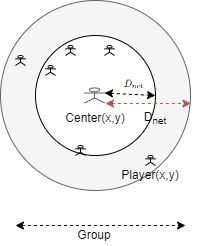
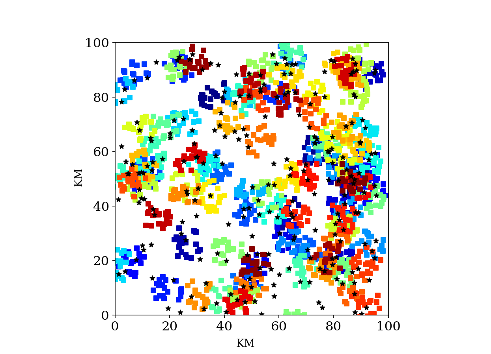
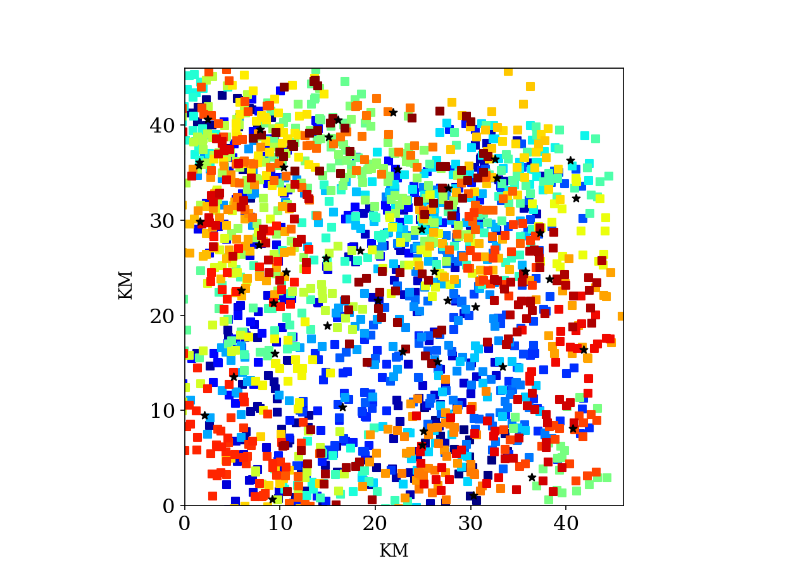

# A Comprehensive Approach for the Placement in the Fog of 
Multiplayer Latency Sensitive Games Servers

Fog computing can be a promising paradigm, for enabling online, multiplayer games with stringent delays. An important problem to be addressed, within this context, deals with the  placement of game servers. It consists of selecting suitable Fog nodes, for hosting the servers, inline with the Quality of Service (QoS) requirements of the respective games, while offering the needed computing capacities, at optimal costs. 

The problem becomes even more challenging, when games with geographically distributed player groups, are considered. In such situations, each server placement aims at achieving an acceptable quality of experience (QoE) for each individual player, with an overall good QoE for the group. 
We develop our proposed game server placement approach, in the Fog, over two stages. The first stage considers the so-called static case, where the RM needs to solve the placement problem, in a global way. This static case consists of the configuration and placement of all the resources of the system, at a particular instant of time (a snapshot). The resulting solution is adopted by the RM for the entire system, and placements are given for each group on an appropriate Fog node. Obviously, while solving the global placement problem, we assume that no changes that occur in the system. The so-called second stage  deals with the more realistic dynamic case, where the RM takes decisions at the end of each time window, to handle the needed changes and re-configurations in a dynamic game system, where players may come and leave and Fog nodes may enter and leave the system. Solving the static case at a smaller scale is a prerequisite for conducting the dynamic case at each step, or after each time window.  

