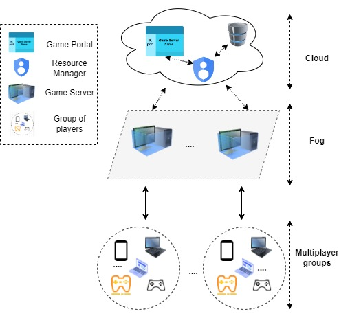
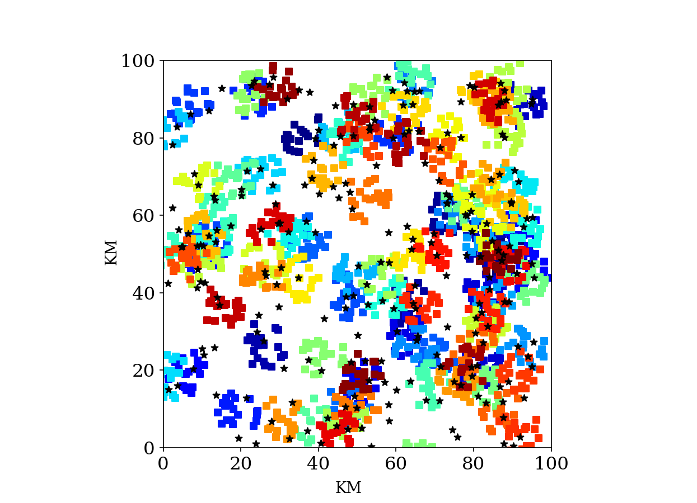

# A Genetic Algorithm for the Placement of Latency-Sensitive Multiplayer Game Servers in the Fog

Fog computing can be a promising paradigm, for enabling online, multiplayer games with stringent delays. An important problem to be addressed, within this context, deals with the  placement of game servers. It consists of selecting suitable Fog nodes, for hosting the servers, inline with the Quality of Service (QoS) requirements of the respective games, while offering the needed computing capacities, at optimal costs. 

The problem becomes even more challenging, when games with geographically distributed player groups, are considered. In such situations, each server placement aims at achieving an acceptable quality of experience (QoE) for each individual player, with an overall good QoE for the group. 
This paper provides an efficient approach for the placement of game servers, satisfying, at the same time, QoS game requirements, capacity issues, while providing good player QoE and balancing costs. The problem being investigated deals with restricted network delays while minimizing server allocation costs.

Our approach is based on an integer linear programming model formulation, with complex constraints dealing with player network delays, server capacities and hosting costs. An efficient and timely solution is provided, using a novel multi-penalty genetic algorithm (GA) heuristic. Results show that our approach outperforms others, in terms of solution quality and with computations speeds enabling its use in real-time settings. 

